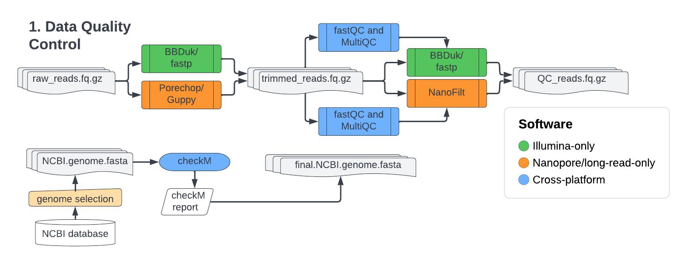
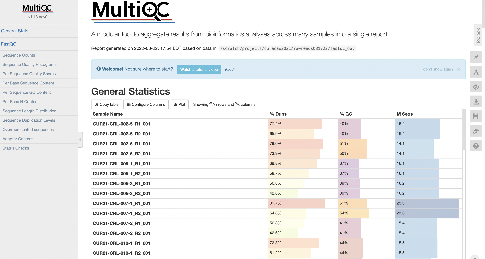
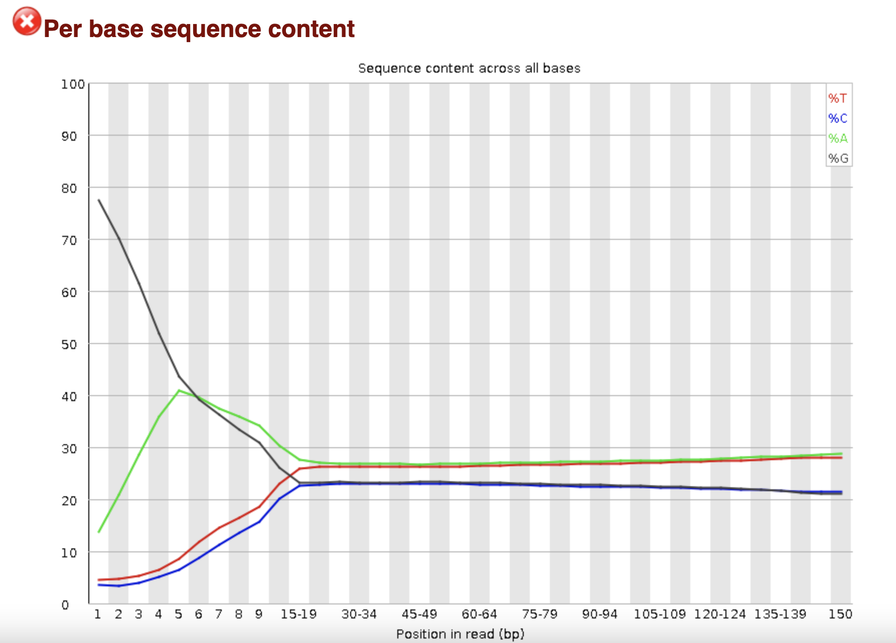
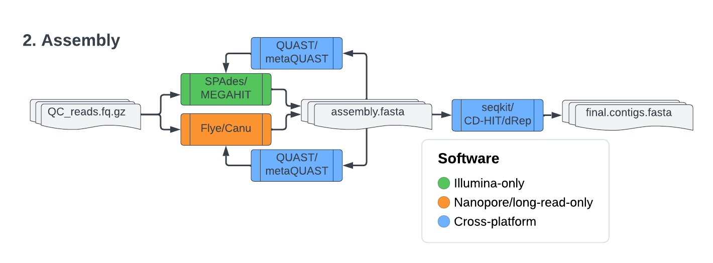
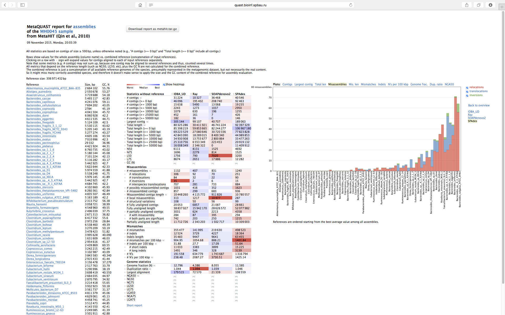
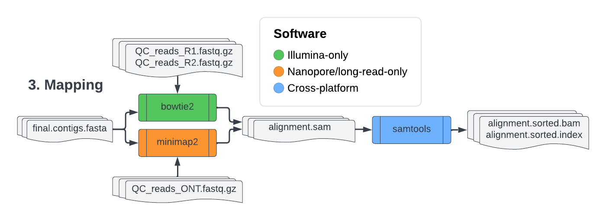
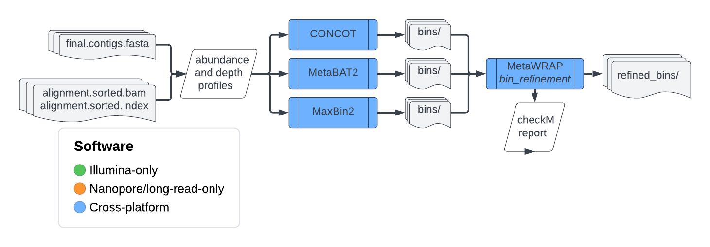

<span style="font-weight:500;font-size:14px">

# <b>General workflow for the analysis of microbial (meta)genomic data</b>
#### last update: 2024-04-03
###### (depending on when you read this repository, it may now be out of date! Make sure you stay up-to-date with the literature and check the GitHub pages of the software)

This is not a tutorial of how to analyse your metagenomic data, or how to work in the HPC/Pegasus/CLIMB or with command line interfaces. This is a workflow to help guide you through the process of which software to look to use for each step and what the steps are. This page demonstrates the base commands utilised to run the software mentioned, you should be reading the GitHub/CodeForge/Website for all these software to understand how they work and all the additional parameters that can be applied to them that are more appropriate for your data.

## Index

0. [Metagenomics data analysis considerations](#sec0)</br>
    0.1. [Project file structure](#sec0.1)</br>
    0.2. [Co-assembly](#sec0.2)</br>
    0.3. [Metagenome assembled-genomes (MAGs)](#sec1.1)</br>
1. [Raw reads quality control](#sec1)</br>
    1.1. [Software](#sec1.1)</br>
    1.2. [Visualising reads](#sec1.2)</br>
    1.3. [Illumina data](#sec1.3)</br>
    1.4. [Nanopore data](#sec1.4)</br>
    1.5. [NCBI data](#sec1.5)<br/>
2. [(Meta)genomic Assembly](#sec2)<br/>
    2.1. [Software](#sec2.1)<br/>
    2.2. [Illumina](#sec2.2)<br/>
    2.3. [Nanopore](#sec2.3)<br/>
    2.4. [NCBI data](#sec2.4)<br/>
3. [Mapping](#sec3)<br/>
    3.1. [Software](#sec3.1)<br/>
    3.2. [Illumina](#sec3.2)<br/>
    3.3. [Nanopore](#sec3.3)<br/>
    3.4. [Basic Samtools usage](#sec3.4)<br/>
4. [Binning metagenomic contigs/recovering MAGs](#sec4)<br/>
    4.1. [Software](#sec4.1)<br/>
    4.2. [CONCOCT](#sec4.2)<br/>
    4.3. [MaxBin2](#sec4.3)<br/>
    4.4. [MetaBAT2](#sec4.4)<br/>
    4.5. [MetaWRAP `bin_refinement`](#sec4.4)<br/>
    4.6. [Other](#sec4.4)<br/>
5. [Binning metagenomic viral contigs into vMAGs](#sec5)<br/>
    5.1. [Software](#sec5.1)<br/>
    5.2. [Identifying viral contigs](#sec5.2)<br/>
    5.3. [Binning viral contigs](#sec5.3)<br/>
    5.4. [Assessing vMAGs](#sec5.4)</br>
6. [Annotating (meta)genomes/MAGs](#sec6)<br/>
    6.1. [Software](#sec6.1)<br/>
    6.2. [Command line annotation](#sec6.2)<br/>
    6.3. [Manual annotation](#sec6.3)<br/>
    6.4. [Visualisation](#sec6.4)</br>
7. [Taxonomic classification of raw reads, contigs and MAGs</b>](#sec7)</br>
    7.1. [Raw reads and contig taxonomy](#sec7.1)</br>
    7.2. [MAG taxonomy](#sec7.2)</br>
8. [Appendix](#sec9)</br>
    8.1. [Building `conda` environments for each step](#sec9.1)</br>
    8.2. [Building complex/nested loops](#sec9.2)</br>
    8.3. [Additional software to consider](#sec9.3)</br>

---
<div style="page-break-after: always;"></div>

<a name="sec0"></a>
## <b>0. Metagenomics data analysis considerations</b>
So before you do any sequencing and analysis you should have an idea of how you are going to process potentially 100's of Gigabytes of data. Some questions you might want to be asking yourself:
- How many biological replicas do I have? Am I going to co-assemble (join all your reads as biological/technical replicas and assemble them together) or assemble them individually?
- Do I want/need metagenome-assembled genomes (MAGs) to answer/address my research questions? Is functional/taxonomical information from contigs sufficient for my study?
- Will I have host DNA in my sample? Is there a host genome available I can use to remove as much host DNA as possible? If there isn't, how can I mitigate this issue (related organism)?
- Am I going to use a metagenomic analysis pipeline aggregator like MetaWRAP or Anvi'o or do all my analysis, or am I going to process it myself?

Some of these questions are easier to answer than others, but as with most metagenomic studies, there is no real golden rule/pathway to follow. Plan your rough workflow before you start any analysis (it's fine if it changes because you need to find alternate software that works or is more appropriate for your data, or you take an alternative direction, ect.) - but you should have a vague roadmap of what you intend to do with this data, and wht type of data you will have at the end for plotting and statistical analysis. But will also help you identify potential caveats with your pipeline.

<a name="sec0.1"></a>
### <u> 0.1. Project file structure</u>
One essential element of your analysis is keeping a strict file structure (It can be hard to be consistent, and I mess this up a lot and always regret it). Below is one example of how you might want to go about structuring your project. This is just an option, everyone has their own way of organising data. However, you want to do it so that if someone looked at your project file in five years with your lab book/paper, they can follow what you did and redo the same analysis. You may have to spend a few days organising your data at the end of the project, but this step is so important for yourself, future lab members, and broader colleagues wanting to revisit your data.

```
Project |  README.txt # summary of project and data contained within, the stage/status of the project, etc..
        |  data         | raw_reads | Sample001_R1.fastq.gz
                                    | Sample001_R2.fastq.gz
                        | QC_reads  | Sample001_CLEAN-READS_R1.fastq.gz
                                    | Sample001_CLEAN-READS_R2.fastq.gz
        |  analysis     | assembly  | Sample001_contigs.fa
                        | mapping   | Sample001_contigs.bam
                                    | Sample001_contigs.bam.bai
                        | binning
                        | MAG_refinement
                        | taxonomy_profiling
                        | functional_profiling
        |  clean_data   | final_contigs
                        | final_MAGS§
        |  results      | final_taxonomy.txt
                        | bin_abundances.txt
                        | functional_profiles.txt
                        | abundance.mapping.tsv
        |  scripts      | reads_QC.sh
                        | assembly.sh
                        | mapping.sh

```

<a name="sec0.2"></a>
### <u> 0.2. Co-assembly</u>
"Co-assembly" refers to assembling contigs using the reads from multiple samples as the input. This is valuable if you have technical replicas, as it can improve the overall sequencing depth of your contigs. You can also use it for biological replicas. The more metagenomes you have co-assembled, the more likely you might begin to start accurately representing the environmental/human sample you are sequencing. However, this does come with some assumptions, such that all the samples share the same functional and taxonomical diversity, this will hide any between-sample variation. If you are undecided on co-assembly, and you have the resources and time, try both and inspect the differences between them. That will help you decide if it is appropriate for your data. Ensure you are using the right assembler, SPAdes does not recommend co-assembly, while MEGAHIT can perform it. 

<a name="sec0.3"></a>
### <u> 0.3. Metagenome assembled-genomes (MAGs) and viral MAGs (vMAGs)</u>
According to the European Nucleotide Archive (ENA) a MAGs is "a single-taxon assembly based on one or more binned metagenomes that has been asserted to be a close representation to an actual individual genome (that could match an already existing isolate or represent a novel isolate)." Minimum standards have been proposed for bacterial MAGs ([Bowers <i>et al.</i>, 2017 <i>Nat.</i>](https://www.nature.com/articles/nbt.3893)).
| Standard | Low-quality | Medium-Quality | High-quality |
| -------- | ------------| ---------------| ------------ |
|  [MIMAG](https://www.nature.com/articles/nbt.3893) |  <50% completion, >10% contamination | 50-95% completion, <10% contamination  | >95% completion, <5% contamination  |

Additionally, minimum standards have also been proposed for vMAGs ([Roux <I>et al.</i>, 2019 <i>Nat. Biotech.</i>](https://www.nature.com/articles/nbt.4306)).
| Standard | Genome fragments (low and medium-quality) | High-quality draft | Finished genome |
| -------- | ------------| ---------------| ------------ |
| [MIUViG](https://www.nature.com/articles/nbt.4306) | <90% complete, or no estimated genome size (fragment) | >90% complete | Complete genome with extensive annotation |

These are good standards when making your MAGs and using them for downstream analysis. 
(v)MAG qualities can be assessed using tools such as [checkM2](https://github.com/chklovski/CheckM2) (bacterial) and [checkV](https://bitbucket.org/berkeleylab/checkv/src/master/) (viral).
MAGs can be improved by re-assembling them (look to <i>MetaWRAPs bin_reassembly</i> module for this) but this can sometimes increase contamination.

---
<div style="page-break-after: always;"></div>

<a name="sec1"></a>
## <b>1. Raw reads quality control</b>
<p align="center">
  
</p>

This section is only interested in the quality control of you (meta)genomic data. The QC step is incredibly important to everything that follows. And it should be done with a lot of consideration to what is going to happen downstream. Dont be affraid to come back and re-assess your read quality if you notice strange things happening with your data.

<a name="sec1.1"></a>
### <u> 1.1. Read QC Software summary</u>
| Software | Description | Link |
| -------- | ------------| -----|
| FastQC   | path to data files to supply the data that will be passed into templates.| https://github.com/s-andrews/FastQC |
| MultiQC | engine to be used for processing templates. Handlebars is the default.| https://multiqc.info/ |
| BBDuk | Tool that combines most common data-quality-related trimming, filtering, and masking operations into a single high-performance tool.| https://jgi.doe.gov/data-and-tools/software-tools/bbtools/bb-tools-user-guide/bbduk-guide/ |
| fastp | A tool designed to provide fast all-in-one preprocessing for FastQ files. This tool is developed in C++ with multithreading supported to afford high performance.| https://github.com/OpenGene/fastp |
| Porechop | Tool for finding and removing adapters from Oxford Nanopore reads. **[DISCONTINUED]** | https://github.com/rrwick/Porechop |
| Nanofilt | Filtering and trimming of long read sequencing data.| https://github.com/wdecoster/nanofilt |
| checkM  | CheckM provides a set of tools for assessing the quality of genomes recovered from isolates, single cells, or metagenomes. | https://github.com/Ecogenomics/CheckM/ |
| SRA Toolkit | The SRA Toolkit and SDK from NCBI is a collection of tools and libraries for using data in the INSDC Sequence Read Archives. | https://github.com/ncbi/sra-tools |
| entrez-direct | Entrez Direct (EDirect) is an advanced method for accessing the NCBI's set of interconnected databases (publication, sequence, structure, gene, variation, expression, etc.) from a UNIX terminal window. Functions take search terms from command-line arguments. Individual operations are combined to build multi-step queries. Record retrieval and formatting normally complete the process. | https://anaconda.org/bioconda/entrez-direct |

<a name="sec1.2"></a>
### <u> 1.2. Visualising reads</u>
The following can be utilised on both Illumina and MinION sequence data. When you have the data you may want to visualise it to understand the quality of your data and identity parameters for trimming and quality filtering.

```bash
  # Illumina data
  fastqc sample001_R1.fastq.gz sample001_R1.fastq.gz

  # Nanopore data
  fastqc --nano sample001-ont.fastq.gz
```
Once the output <i>FastQC</i> will be a HTML file for each read file that you can open into your web browser and look at the quality of metagenomic sequences.


Since this will generate a lot of files and looking through each one individually is an inconvenience, you can aggragate them all with <i>MultiQC</i>. This makes it easier to get an overall idea of the data and identiy  parameters that apply to the dataset as a whole. Generally speaking, if you are going to do something like a co-assembly you will want all your reads of a similar length and quality.



<a name="sec1.3"></a>
### <u>1.3. Illumina data</u>

This is where the two types of data will have to be treated differently. With both types of data, after you have dones the quality filtering, you should definitely be running the QC-ed reads back through fastQC/MultiQC in order to confirm that the poor quality reads have been removed, ther are no more remaining adaptors, and that the data is ready for downstream processing.
#### Adaptor, Quality and Entropy filtering with <i>BBDuk</i>
BBDuk is a powerful took that does multiple types of filtering in one tool.

```bash
  for f in *_R1_001.fastq.gz; do
      name=$(basename $f R1_001.fastq.gz)
      # Adaptor trimming - make sure the path to the Illumina adaptors is correct!
      bbduk.sh -Xmx512m -da \
      in1=${name}_R1_001.fastq.gz in2=${name}_R2_001.fastq.gz \
      out1=${name}_1out1.fastq.gz out2=${name}_2out1.fastq.gz \
      ktrim=rl k=23 mink=11 hdist=1 qtrim=rl trimq=30 \
      ref=/nethome/nsv19/apps/bbmap/resources/adapters.fa
      # Quality filtering: This will discard reads with average quality below 10.
      # If quality-trimming is enabled, the average quality will be calculated
      # on the trimmed read.
      bbduk.sh -Xmx512m -da \
      in1=${name}_1out1.fastq.gz in2=${name}_2out1.fastq.gz \
      out1=${name}_1out2.fastq.gz out2=${name}_2out2.fastq.gz maq=30
      # Entropy filtering
      bbduk.sh -Xmx512m -da \
      in1=${name}_1out2.fastq.gz in2=${name}_2out2.fastq.gz \
      out1=${name}_1_outfinal.fastq.gz out2=${name}_2_outfinal.fastq.gz \
      entropy=0.90
  done
```

#### Additional quality filtering and trimming (head/tail) with <i>fastp</i>
If after running <i>BBDuk</i>, or any other read QC software, there are still some  issue that can persist.

One example of where this can happen is with a polyG tail on your reverse read, this would look like this in <i>fastQC</i>. This is common to Illumina data, but just because you have run a powerfull tool that QC-es your reads in many ways, doesn't mean that those are the best quality data to proceed with. Check again with <i>fastQC</i> after QC/before assembly.



Poly-G tails need to be remove as they will impact on your assembly, this can be done with <i>fastp</i>:
```bash
  # in th example above we can see from fastp that the polyG tail goes to \
  #around basepair # 15, so we use this parameter.
  fastp -i in.R1.fq.gz -I in.R2.fq.gz --trim_poly_g 15 -o out.R1.fq.gz -O out.R2.fq.gz
```
<i>fastp</i> can do other things, such as remove polyX, length/quality filter, low complexity filter (entropy) and identify and remove adaptors. So there are options as to what tools you can use when it comes to quality filtering.

<b>Whatever tool you sue, just make sure that you are constantly looking to visually confirm that your reads are of good quality!</b>

<a name="sec1.4"></a>
### <u> 1.4. Nanopore data</u>
#### Adaptor trimming with <i>Porechop</i>
Oxford nanopores <i>Guppy</i> is the companies software for adaptor trimming and quality control. After you have sequenced and basecalled your data Guppy may have done some quality control, and demultiplexed, but there are cases where this can go a little wierd/wrong. Porechop is a good alternative software for adaptor trimming if you are concerned about your Guppy data.

```bash
  ## basic adaptor trimming
  porechop -i input_reads.fastq.gz -o output_reads.fastq.gz

  ## Demultiplex barcoded reads
  porechop -i input_reads.fastq.gz -b output_dir
```

#### Quality filtering and trimming (head/tail) with <i>NanoFilt</i>

```bash
  gunzip -c output_reads.fastq.gz | NanoFilt -q 10 -l 500 --headcrop 50 \
  --tailcrop 50 > trimmed-reads.fastq.gz
```
Same as above, make sure you are checking your data frequently for it quality before procceding.

### <u>1.5 NCBI (meta)genomic data</u>
Batch downloading and whole-genomes and metagenomes from NCBI/RefSeq is a valuable approach to utilising existing data.. However, just because you have downloaded it from a repository doesnt mean you should bypass a QC step.
#### Batch downloading and QC of bacterial genomes from NCBI:
The easiest way to do this is the following:
```bash
# Download the NCBI assembly summary text file ##
wget ftp://ftp.ncbi.nlm.nih.gov/genomes/genbank/assembly_summary_genbank.txt

## Downloading a selection of genomes from a list ##
nano selected_genomes.list # paste in your list of accession numbers
# pull out the https path for you genomes of interest
grep -f genomes.list assembly_summary.txt > selected_genomes.txt
# create a scrip that has wget and the ftp path
cat selected_genomes.txt | awk -F '\t' '{print $20}' \
    | sed -E 's/^https(.*)(\/.*)/wget ftp\1\2\2_genomic.fna.gz/g' > selected_genomes.sh
bash coral_genomes.sh # your genomes will begin downloading
gunzip *.fna.gz

## Downloading a selection of genomes from a word search ##
## in this case downloading the reference and representative bacterial genomes from RefSeq
wget ftp://ftp.ncbi.nlm.nih.gov/genomes/refseq/assembly_summary_refseq.txt
# add the date to the assembly summary you download
grep 'reference' assembly_summary_refseq.090122.txt >> rep_ref.refseq.txt
grep 'representative' assembly_summary_refseq.090122.txt >> rep_ref_refseq.txt
#
cat rep_ref_refseq.txt | awk -F '\t' '{print $20}' \
    | sed -E 's/^https(.*)(\/.*)/wget ftp\1\2\2_genomic.fna.gz/g' > rep_ref_refseq.sh

```
Once you have all the genomes, they will be in their own individual fasta file, it is good to run checkM to identify potentially contaminated bacterial genomes and decide whether or not to keep each genome for downstream analysis. <i>CheckM2</i> can perform this for you.
```bash
  checkm lineage_wf <bin folder> <output folder> -t 64
```
This will generate a table that will give you the completeness and contamination of the genomes. Note that you will use this same tool for assessing metagenome-assembled genomes (MAGs) futher downstream.

| Bin Name | Marker Lineage | #Genomes | #Markers | #Marker Sets| 0 | 1 | 2 | 3 | 4 | 5+ | Completeness | Contamination |
| ------ | ------ | ------ | ------ | ------ | ------ |------ | ------ | ------ | ------ | ------ | ------ | ------ |
|genome1|k_Bacteria|138|331|240|2|329|0|0|0|0|99.7|0.0|
|genome2|p_Firmicutes|100|295|158|0|293|1|1|0|0|100.0|1.9|
|genome3|f_Rhodobactereacea|46|654|332|2|610|32|9|1|0|99.6|11.3|

Generally speaking, you want your genome Completeness to be >75% and the contamination <10%. In the example above you would keep genome1 and genome2 but remove genome3 as it has contamination above 10%.

#### Downloading reads from the SRA database:
Determine the SRR number and download the data using the <i>SRA Toolkit</i>:
```bash
prefetch -v SRR925811
```
After you have downloaded the data, you need to convert it from SRAs compressed format (`.sra`) to fastq:
```bash
fastq-dump --outdir path/to/ouput/fastq/ --split-files path/to/sra/SRR925811.sra
```
If it's Illumina data you are downloading, this should produce two fastq files (one for R1 and one for R2), and only one for Nanopore/IonTorent.
If you just want to download X number of raw (fastq) reads to standard output from a particular run you can use a command like the following. This can be useful to just take a quick look at some reads, or obtain some reads for testing purposes or just check whether the SRA toolkit is even working for you.
```bash
fastq-dump -X 5 -Z SRR925811
```
To run the whole process in a single long pipe, you could try the following:
```bash
esearch -db sra -query | efetch --format runinfo | cut -d ',' -f 1 | grep SRR \ | xargs fastq-dump --split-files --bzip2
```
You can then proceed to QC this metagenomic data as described above depending on the sequencing platform the data originated from.

---
<div style="page-break-after: always;"></div>

<a name="sec2"></a>
## <b>2. (Meta)genomic Assembly</b>


While both types of data again need to be assembled differently (with the exception of hybrid assemblies)

<a name="sec2.1"></a>
### <u>2.1. Software summary</u>
There are a lot of assemblers (not limitated to those listed below), choosing the right assembler for your data type and what reseach goals is an important step. Make sure you are reading the github page and the papers for these assemblers to identiy when they are appropriate.

| Software | Description | Link |
| ------ | --------------| --------------|
| SPAdes   | SPAdes - St. Petersburg genome assembler - is an assembly toolkit containing various assembly pipelines. The current version of SPAdes works with <b>Illumina or IonTorrent reads</b> and is capable of providing <b>hybrid assemblies using PacBio, Oxford Nanopore and Sanger reads</b>. You can also provide additional contigs that will be used as long reads. | https://github.com/ablab/spades |
| MEGAHIT | MEGAHIT is an ultra-fast and memory-efficient NGS assembler. It is optimized for metagenomes, but also works well on generic single genome assembly (small or mammalian size) and single-cell assembly.| https://github.com/voutcn/megahit |
| Flye | Flye is a de novo assembler for single-molecule sequencing reads, such as those produced by <b>PacBio and Oxford Nanopore Technologies</b>. It is designed for a wide range of datasets, from small bacterial projects to large mammalian-scale assemblies. The package represents a complete pipeline: it takes <b>raw PacBio/ONT reads</b> as input and outputs polished contigs. Flye also has a special mode for metagenome assembly.| https://github.com/fenderglass/Flye |
| Canu | Canu is a fork of the Celera Assembler, designed for high-noise single-molecule sequencing (such as the <b>PacBio RS II/Sequel or Oxford Nanopore MinION</b>). | https://github.com/marbl/canu |
| seqkit | A cross-platform and ultrafast toolkit for FASTA/Q file manipulation. | https://bioinf.shenwei.me/seqkit/ |
| QUAST/ metaQUAST | QUAST stands for QUality ASsessment Tool. It evaluates genome/metagenome assemblies by computing various metrics. The current QUAST toolkit includes the general QUAST tool for genome assemblies, MetaQUAST, the extension for metagenomic datasets, QUAST-LG, the extension for large genomes (e.g., mammalians), and Icarus, the interactive visualizer for these tools. | https://github.com/ablab/quast |
| CD-HIT | CD-HIT is a widely used program for clustering biological sequences to reduce sequence redundancy and improve the performance of other sequence analyses. |  https://github.com/weizhongli/cdhit/wiki |
| fastANI |  FastANI is developed for fast alignment-free computation of whole-genome Average Nucleotide Identity (ANI). |  https://github.com/ParBLiSS/FastANI |
| Bandage | Bandage is a GUI program that allows users to interact with the assembly graphs made by de novo assemblers such as Velvet, SPAdes, MEGAHIT and others. **[DISCONTINUED]** | https://github.com/rrwick/Bandage |

<a name="sec2.2"></a>
### <u>2.2. Illumina</u>
#### <u>SPAdes</u>:
SPAdes is very powerful in that it has lots of modes that it can be run in order to assemble your metagenomic data with various goals in mind. `biosyntheticSPAdes` if you are looking to retain long high-GC biosynthetic gene clusters in your assemblies. `plasmidSPAdes` and `metaplasmidSPAdes` output only DNA sequences from putative plasmids. There is also `metaviralSPAdes`, which has repeat resolution and extrachromosomal element dection.

```bash
  # Brief  example of base SPAdes
  # whole-genomes
  spades.py --careful -1 sample001.R1.fastq.gz -2 sample001.R1.fastq.gz -o sample001_spades_out

  # metagenomes
  spades.py --meta -1 sample001.R1.fastq.gz -2 sample001.R1.fastq.gz -o sample001_metaspades_out
```


#### <u>MEGAHIT</u>:
MEGAHIT <b> is optimized for metagenomes</b>, but also works well on generic single genome assembly (small or mammalian size) and single-cell assembly - decide carefully if you are using MEGAHIT for non-metagenome assemblies.

```bash
  megahit -1 sample001_R1.fastq -2 sample001_R2.fastq -o sample001_megahit_assembly
```

<a name="sec2.3"></a>
### <u> 2.3. Nanopore</u>
There are two assembler that can be used for Nanopore data.
#### <u>Flye</u>:
Flye is good for nanopore assemblier and easy to use, and can be used for both whole-genomes and metagenomes (<i>metaFlye</i>).
```bash
  # for bacterial whole-genomes
  flye --nano-raw sample001-ont.fastq.gz --out-dir sample001_flye

  # for metagenomes
  flye --meta --nano-raw sample001-ont.fastq.gz --out-dir sample001_metaflye
```
There is even a tool called <i>viralFlye</i> that can reincorporate the reads less than <1kb, that Flye discards, in order to assembly viral contigs. The biggest drawback of <i>Flye</i> is that there are not that many adjustable parameters and it will not incorporate reads <1kb, which can be a problem. For example, if you metagenome/genome seuqence data is fragmented (mixture of short and long reads) or you are sequencing cDNA.

#### <u>Canu</u>:
<i>Canu</i> is an alternative to <i>Flye</i>. Can be used to assemble reads less than 1kb, offers a lot of control of how the assembler works. However, it is awkward and difficut to run in the HPC. Running it 'locally' isnt an issue, but slow. If you want to run it on a lots of (meta)genomes in a HPC it gets strange as <i>Canu</i> generates its own jobs in the process of doing the assembly.

```bash
  # running it outside the HPC server (this e.g. for a genome of 5Mbp with data that has
  # already been trimmed & QC-ed, so only an assembly is specificed)
  canu -assemble genomeSize=5m -p sample001 -d sample001_canu_assembly \
      minReadLength=150 \ # can change the read length used - default 1kb (e.g. 150 bp)
      minOverlapLength=50 # default 500bp - adjust as necessary
      useGrid=false # this flag to run not in the HPC (can still be submited as a job)
      -nanopore sample001.ont.fastq.gz  # the data
      ## this is just a sample of what can be done with Canu! Read docs for more info

  # running it in the HPC server - far more complicated.
  # you have to specify all the HPC information
  canu -assemble genomeSize=5m -p sample001 -d sample001_canu_assembly \
      minReadLength=150 minOverlapLength=50 useGrid=true \
      gridOptions=<string> # STILL HAVENT ENTIRELY FIGURED IT OUT :(
```

<a name="sec2.4"></a>
### <u>2.4. Hybrid assembly</u>
#### <u>HybridSPAdes</u>:
HybridSPAdes can be used, however it is still at a developmental stage, so just bear that in mind in case anything downstream looks suspicious.
```bash
  # whole-genomes
  spades.py --careful -1 sample001.R1.fastq.gz -2 sample001.R1.fastq.gz \
            --nanopore sample001-ont.fastq.gz -o sample001_spades_out
  # metagenomes
  spades.py --meta -1 sample001.R1.fastq.gz -2 sample001.R1.fastq.gz \
            --nanopore sample001-ont.fastq.gz -o sample001_metaspades_out
```

<a name="sec2.5"></a>
### <u>2.5. Filter and assess contigs</u>
Depending on what you do downstream, you may want to do some of the following to your contigs
#### <u>QUAST</u>:
QUAST may be used to generate summary statistics (N50, maximum contig length, GC %, # genes found in a reference list or with built-in gene finding tools, etc.) for a single assembly. It may also be used to compare statistics for multiple assemblies of the same data set (e.g., SPAdes run with different parameters, or several different assemblers). This is where you can begin assessing the suitability of your assembler for your particular set of data. The QUAST package works both with and without reference genomes. However, it is much more informative if at least a close reference genome is provided along with the assemblies. The tool accepts multiple assemblies, thus is suitable for comparison.

```bash
  # Assess whole-genome assembly with reference genomes
  quast.py sample001.contigs.fasta -r reference.fasta.gz \
        -1 sample001.R1.fastq.gz -2 sample001.R1.fastq.gz \
        -o sample001.quast.output

  # Assess and compare metagenome assemblies
  metaquast.py sample001.spades.contigs.fasta sample001.megahit.contigs.fasta \
        -o sample001.quast.output
```
QUAST will generate a HTML file that you can inspect to see the results of its assesment.



#### <u>Size filter contigs</u>:
Contigs filtered to remove contigs less that 1kb. <i>seqkit</i> is a multifunctional/crossplaotform tool that is useful to get statistics on your contigs and remove reads less than 1Kb.
```bash
  seqkit stats contigs.fasta
  #file           format  type  num_seqs    sum_len  min_len  avg_len  max_len
  #contigs.fasta  FASTA   DNA   XX          XX       XX       XX       XX

  seqkit seq -m 1000 contigs.fasta > contigs.min1kb.fasta
```
#### <u>De-replicate contigs</u>:
Some software might need you to dereplicate your contigs before using them. There are a number of software that can de-replicate. If you are de-reoplicating contigs <i>cd-hit-est</i> is suitable, if you are dereplicating MAGs, genomes or millions of contigs <i>cd-hit-est</i>  wont be powerful enough and you will have to use something like <i>dRep</i>.
```bash
  # CD-HIT with a 95% identity cutoff
  cd-hit-est -i contigs.min1kb.fasta -o contigs.min1kb.cdhit95.fasta -c 0.95 -n 10

  #dRep workflow measures the identity of the contigs then dereplicates in a 2 step process.
  dRep compare output_directory -g path/to/genomes/*.fasta
  dRep dereplicate output_directory -g path/to/genomes/*.fasta
```

#### <u>Contig graphs</u>:
There are a number of ways you can access you (meta)genomic assembly and tools that can help you do it, and unfortunately depending on the assembler you use you will need to run their own method of generating the contig graph. After you have generated the FASTG file you can utilise <i>Bandage</i> to visualise the assembly.

##### MEGAHIT:
All intermediate contigs assembled in the iteration of kmer_size=k are moved to the folder `intermediate_contigs` in the output directory. To visualize contig graph in <i>Bandage</i>, the first step is to convert the fasta file(s) `intermediate_contigs/k{kmer_size}.contigs.fa` into SPAdes-like FASTG format.
```bash
  megahit_toolkit contig2fastg 99 k99.contigs.fa > sample001.megahit.k99.fastg
```
##### SPAdes:
```bash
  spades-gbuilder sample001.spades.assembly/ -k 99 -fastg sample001.spades.k99.fastg
```
##### Flye:
Repeat graphs produced by Flye could be visualized using Bandage. Repeat graph before repeat resolution could be found in the `20-repeat/graph_before_rr.gv` file.

---
<div style="page-break-after: always;"></div>

<a name="sec3"></a>
## <b>3. Mapping reads to contigs</b>
Long and short-read mappers cant really be used interchangably, so again nanopore and illumina data should be handled seperately here.



<a name="sec3.2"></a>
### <u>3.2. Software</u>
| Software | Description | Link |
| ------ | --------------| --------------|
| bowtie2 | Bowtie 2 is an ultrafast and memory-efficient tool for aligning sequencing reads to long reference sequences. | https://github.com/BenLangmead/bowtie2 |
| minimap2 | Minimap2 is a versatile sequence alignment program that aligns DNA or mRNA sequences against a large reference database. | https://github.com/lh3/minimap2 |
| samtools | Samtools is a suite of programs for interacting with high-throughput sequencing data.  | https://github.com/samtools/samtools |

<a name="sec3.2"></a>
### <u>3.2. Illumina</u>
There are other mapping software not mentioned here that you may want to explore, but <i>bowtie2</i> highly cited in the lirature and very reliable.

```bash
  # step 1: build a bowtie2 index from your contigs
  bowtie2-build -x contigs/sample001.final.contigs.fasta mapping/index/sample001.final.contigs.bt2index

  # step 2: align/map reads
    # Aligning unpaired reads
    bowtie2 -x mapping/index/sample001.final.contigs.bt2index  -U reads/sample001.QC_reads.R1-R2.fastq.gz \
            > mapping/sample001.alignment.sam
    # Aligning paired reads
    bowtie2 -x mapping/index/sample001.final.contigs.bt2index  \
            -1 reads/sample001.QC_reads.R1.fastq.gz -2 reads/sample001.QC_reads.R2.fastq.gz \
            > mapping/sample001.alignment.sam
```

<a name="sec3.3"></a>
### <u>3.3. Nanopore</u>
So apaprently now bowtie2 can do long-read alignment, do that might be worth exploring, but one of the amin tools for long-read mapping is <i>minimap2</i>.
```bash
  # create a minimap index
  minimap2 -x map-ont -d sample001.final.contigs.mmi sample001.final.contigs.fasta

  # map the reads
  minimap2 -ax map-ont sample001.contigs.mmi sample001.QC_reads.ONT.fastq.gz > sample001.alignment.sam
```

<a name="sec3.4"></a>
### <u>3.4. Basic Samtools usage</u>
Once you have the alignment `.sam` you will need to go compress it into a `.bam` file, sort and index it.
You do all of this with <i>samtools</i>.
```bash
  samtools sort -o mapping/sample001.sorted.bam mapping/sample001.sam
  samtools index mapping/sample001.sorted.bam
```
With a sorted and index `BAM` file you can extract coverage information that will be used during the metagenomic binning step, this will be covered below.


---
<div style="page-break-after: always;"></div>

<a name="sec4"></a>
## <b>4. Binning metagenomic contigs/recovering MAGs</b>
Here 3 ways to bin your metagenome bins are described. Each have their own advantages and disadvantages. Finally Also describes is MetaWRAP's `bin_refinement` module that will take bins from multiple binners and create refined bins based on a quality measures (completenes and contamination).



<a name="sec4.1"></a>
### <u>4.1. Software</u>
| Software | Description | Link |
| ------ | --------------| --------------|
| CONCOT | A program for unsupervised binning of metagenomic contigs by using nucleotide composition, coverage data in multiple samples and linkage data from paired end reads. | https://github.com/BinPro/CONCOCT |
| MaxBin2 | MaxBin is a software for binning assembled metagenomic sequences based on an Expectation-Maximization algorithm.  | https://sourceforge.net/projects/maxbin/ |
| MetaBAT2 | MetaBAT: A robust statistical framework for reconstructing genomes from metagenomic data  | https://bitbucket.org/berkeleylab/metabat/src/master/ |
| MetaWRAP | A flexible pipeline for genome-resolved metagenomic data analysis | https://github.com/bxlab/metaWRAP |

<a name="sec4.2"></a>
### <u>4.2. CONCOCT</u>

```bash
  # Create a list of the sample names
  ls mapping/*sorted.bam | sed 's/.sorted.bam//g' | sed 's/mapping\///g' > samp-names.tsv
  BAMS=`ls mapping/*.bam | python -c 'import sys; print(" ".join([x.strip() for x in sys.stdin.readlines()]))'`

  # split the reads from your contgs into 10KB chunks and create a bed file
  # to latter re-merge them
  cut_up_fasta.py original_contigs.fa -c 10000 \
                  -o 0 --merge_last -b contigs_10K.bed \
                  > contigs_10K.fa

  # generate the coverage table
  concoct_coverage_table.py binning/contigs_10K.bed --samplenames sample-names.tsv \
                            mapping/*.bam > binning/coverage_table.csv
  # run concoct
  concoct --composition_file binning/contigs_10K.fa \
          --coverage_file binning/coverage_table.csv -b binning/

  # Merge subcontig clustering into original contig clustering
  merge_cutup_clustering.py binning/clustering_gt1000.csv > binning/clustering_merged.csv

  # Extract bins as individual FASTA
  extract_fasta_bins.py contigs/final.contigs.fa \
                        binning/clustering_merged.csv \
                        --output_path binning/concoct/
        # CONCOCT output the bin name as a "number".fa (e.g. "1.fa")
        # which a lot of software is NOT going to like filenames starting
        # number -_- (change to "bin1.fa")
        for f in binning/concoct/*.fa; do
          mv $f binning/concoct/bin"$(basename $f)"
        done
```

<a name="sec4.3"></a>
### <u>4.3. MaxBin2</u>
```bash
  # generate abundance data
  for f in mapping/sorted.bam; do
    pileup.sh in=mapping/"$(basename $f)" \
              out=mapping/"$(basename $f .sorted.bam)".alignment.cov.txt overwrite=true

    awk '{print $1"\t"$5}' mapping/"$(basename $f .sorted.bam)".alignment.cov.txt \
        | grep -v '^#' > mapping/"$(basename $f .sorted.bam)".alignment.abundance.txt
  done

  # generate a file of all the paths to the abundace data
  realpath mapping/*.alignment.abundance.txt > mapping/abund.list.txt

  # run MaxBin2
  run_MaxBin.pl -thread 4 -contig megahit/final.contigs.fa \
              -out binning/maxbin2/ \
              -abund_list mapping/abund.list.txt
```
<a name="sec4.4"></a>
### <u>4.4. MetaBAT2</u>
```bash
  # generate the depth profiles
  jgi_summarize_bam_contig_depths --outputDepth mapping/depth.txt mapping/*.bam
  # run metabat2
  metabat2 -m 1500 -t 8 -i contigs/final.contigs.fa \
        -a mapping/depth.txt -o binning/metabat2/
```

<a name="sec4.5"></a>
### <u>4.5. MetaWRAP `bin_refinement`</u>


```bash
  # >70% completion and <10% contamination
  metawrap bin_refinement -o binning/refined_bins_20-50 -c 20 -x 50 -t 12 \
                          -A binning/metabat2/ \
                          -B binning/maxbin2/ \
                          -C binning/concoct/
  conda deactivate
```

<a name="sec4.6"></a>
### <u>4.6. Other</u>
A lot of the pipeline here (QC, assembly, mapping binning) can all be performed by [MetaWRAP](https://github.com/bxlab/metaWRAP). It does have some odd things it can do often (issues i've encountered include bin naming, issues with deftlines), but they are all fixable and it does work and uses all thats been described so far. Currently it is mostly used with Illumina data.

#### <u>To de-replicate MAGs?</u>:
In theory, dereplication identifies groups of identical or highly similar genomes in a given dataset based on a user-provided sequence identity cutoff, and reduces them to a single representative genome. There is a detailed debate about this elsewhere [(Evans and Denef, 2020, <i>mSphere</i>)](https://journals.asm.org/doi/10.1128/mSphere.00971-19) as well as a more informal discussion on the topic by the [anvi'o group blog](https://merenlab.org/2019/12/12/dereplicate-or-not/).

To dereplicate bins you will need to use something like <i>fastANI</i> or <i>pyANI</i>, or a similar sorty of software utilised for genome de-replication [as previously mentioned](#sec2.5). I like to use the anvio parse of fastANI as it give a nice report showing you all the members of a cluster and the representative genome picked from that cluster (so I can change it out if there is something wrong with that cluster. You will need to first generate a text file containing the name and the path of the mag.

```bash
    conda activate anvio-7.1

    head bmags.txt
    # name  path
    # mag1  path/to/mag1.fa
    # mag2  path/to/mag2.fa

    # dereplicating the bacterial genomes with anvio
    anvi-dereplicate-genomes -f bmags.txt -o bMAG-95PERC \
                             --program fastANI \
                             --similarity-threshold 0.95 \
                             --fragment-length 3000 \
                             --min-full-percent-identity 0.95 \
                             --min-alignment-fraction 0.5 \
                             --significant-alignment-length 3000 \
                             -T 64
```
The parameters you use to dereplicate viral and plasmid bins are going to be a little different. I chose these parameters based on [Kauffman <i>et al.</i>, 2022 <i>Nat. Comms</i>](https://www.nature.com/articles/s41467-021-27583-z). The parameteres are only a little different to take into accound the shorted genome lengths of viruses/plasmids to bacterial genomes.

```bash
    # dereplicating the plasmids with anvio
    anvi-dereplicate-genomes -f pmags.txt -o pmag_derep99 \
                             --program fastANI \
                             --fastani-kmer-size 16 \
                             --fragment-length 100 \
                             --similarity-threshold 0.99 \
                             --min-full-percent-identity 0.99 \
                             --min-alignment-fraction 0.5 \
                             -T 64

    # dereplicating the plasmids with anvio
    anvi-dereplicate-genomes -f vmags.txt -o vmag_derep99 \
                             --program fastANI \
                             --fragment-length 100 \
                             --similarity-threshold 0.99 \
                             --min-full-percent-identity 0.99 \
                             --min-alignment-fraction 0.5 \
                             --significant-alignment-length 100 \
                             -T 64
```

---
<div style="page-break-after: always;"></div>

<a name="sec5"></a>
<a name="sec5"></a>
## <b>5. Binning metagenomic viral contigs into vMAGs</b>

<a name="sec5.1"></a>
### <u>5.1 Software</u>
| Software | Description | Link |
| ------ | --------------| --------------|
| VIBRANT   | Virus Identification By iteRative ANnoTation | https://github.com/AnantharamanLab/VIBRANT |
| vRhyme | Binning Virus Genomes from Metagenomes | https://github.com/AnantharamanLab/vRhyme |
| VirSorter2 |  VirSorter2 applies a multi-classifier, expert-guided approach to detect diverse DNA and RNA virus genomes. |  https://github.com/jiarong/VirSorter2 |
| checkV | Assessing the quality of metagenome-assembled viral genomes | https://bitbucket.org/berkeleylab/checkv/src/master/ |

<a name="sec5.2"></a>
<a name="sec5.2"></a>
### <u>5.2 Identifying viral contigs</u>
There are a few programmes that will identity viral contigs, and you and see a recent assesments of their performance. Here I will only briefly introduce two.
#### <b>VIBRANT:</b>

```bash
  VIBRANT_run.py -i sample001.final.contigs.fasta
```
When you have your `.faa` files from the VIBRANT output, you can simplify the deftlines with `simplify_faa-ffn.py` from the annotation information - this is important if you use the `.faa` file for <i>BLASTp</i> analyses as it wont like complicated deftlines.
```bash
  python3 simplify_faa-ffn.py sample001.phages_combined.faa
```
#### <b>VirSorter2:</b>

```bash
  virsorter run -w sample001_virsorter -i sample001.final.contigs.fasta \
                --min-length 1500 -j 4 all
```

<a name="sec5.3"></a>
### <u>5.3. Binning viral contigs</u>
A recent addition to the viral software, this one needs to be coupled with the viral contigs identified from VIBRANT. You will first have to map your reads to the viral contigs, this can be done the same [as previously described](#sec3).

```bash
  vRhyme -i sample001.phages_combined.fasta \
         -b sample001.phages_combined.alignment.sorted.bam \
         -t 16 -o sample001_vRhyme/
```

### <u>5.3. Assessing vMAGs</u>
This can be done with checkV directly on the contigs, but if you want to do it on the vMAGs first you ahve to collapse all the indiviodiaul contigs that make up the vMAG into a single contig - filling the gaps with poly-Ns.

```bash
  # merge the vMAG contigs into a singe contig and filling the gaps
  vMAG001_no-gap.fna vMAG001_no-gap.fna #this part is a work in progress >_<

  # run checkV ont the single-contig vMAGs
  checkv end_to_end vMAG001_no-gap.fna vMAG001_no-gap_checkv -t 16
```

---
<div style="page-break-after: always;"></div>

<a name="sec6"></a>
## <b>6. Annotating (meta)genomes/MAGs</b>
When you need to annotate, you can annotate from contigs after assembly or your MAGs after binning. There are lots of annotation softwares, but your biggest limitation will often be the database you selecet or the software utilises. Here i will cover two appraoches to annotation, a command line interface method, which is scalable and hig-throughput and manual appraoches.

<a name="sec6.1"></a>
## <b>6.1 Software</b>
| Software | Description | Link |
| ------ | --------------| --------------|
| Prokka   | Prokka: rapid prokaryotic genome annotation. Whole genome annotation is the process of identifying features of interest in a set of genomic DNA sequences, and labelling them with useful information. Prokka is a software tool to annotate bacterial, archaeal and viral genomes quickly and produce standards-compliant output files. | https://github.com/tseemann/prokka |
| DRAM | DRAM (Distilled and Refined Annotation of Metabolism) is a tool for annotating metagenomic assembled genomes and VirSorter identified viral contigs. DRAM annotates MAGs and viral contigs using KEGG (if provided by the user), UniRef90, PFAM, dbCAN, RefSeq viral, VOGDB and the MEROPS peptidase database as well as custom user databases.| https://github.com/WrightonLabCSU/DRAM |
| genoPlotR |  R pakcage for the visualisation of genomic regions | https://genoplotr.r-forge.r-project.org/ |
| Proksee | Proksee is an expert system for genome assembly, annotation and visualization. To begin using Proksee, provide a complete genome sequence, sequencing reads or a CGView/Proksee map JSON file. | https://proksee.ca/ |
| MAC | Merging assemblies by using adjacency algebraic model and classification. | https://github.com/bioinfomaticsCSU/MAC |

<a name="sec6.2"></a>
### <u>6.2. Command line annotation</u>
#### <b>Prokka *(Bacterial, Viral and Eukaryote)*:</b>
Very easy to set up and run. Very well cites and highly utilised annotator. I have found in the past that it can get a stuck with MAGs (infinitely pending/running). Other than that, I dont often have issues running Prokka.
```bash
  # single bacterial genome
  prokka --kingdom Bacteria --outdir genome001_prokka genome001.fasta

  # metagenomic contigs/mags
  prokka --metagenome --kingdom Bacteria --outdir sample001.contigs_prokka sample001.contigs.fasta
  prokka --metagenome --kingdom Bacteria --outdir bin001_prokka bin001.fasta
```

#### <b>Pharokka *(Viral)*:</b>
This is basically prokka but running with PHANOTATE to identify the viral coding regions instead of prodigal (which prokka uses). I have had issues running this as a job in the server - it tends to not output everything properly. But it does generally work.

```bash
  # metagenomic sample need the -m flag
  pharokka.py -m -i vMAG001.fasta -o vMAG001_pharokka/ \
  -t 16 -d /nethome/pxh390/db/pharokka
```
#### <b>DRAM *(viral genomes, contigs and vMAGs)*:</b>
The set up for DRAM is a little tricky (follow the github page and it should be okay), but the most useful part of this software is the distillation of the annotations. It additionally helpful as its made specifically for viral genomes outputted from VSorter2. (havent tested it with VIBRANT output, might be worth a comparison at some point), and I havent tested DRAM one much.
```bash
  # Step1: run the annotation:
  DRAM.py annotate -i my_bins/*.fa -o annotation

  #Step 2: Summarise the annotation
  DRAM.py distill -i annotation/annotations.tsv \
                  -o genome_summaries --trna_path annotation/trnas.tsv \
                  --rrna_path annotation/rrnas.tsv
```
<a name="sec6.3"></a>
### <u>6.3. Manual annotation</u>
You may want, or need, to mannually annoate a genome/contig because you simply do not have the space on your HPC to dowbload and store 100s of GBs of database infomation needed for the best annotation of your genome. This is when you may want to use a web-base tool such as [PATRIC](https://www.patricbrc.org/) or [MG-RAST](https://www.mg-rast.org/). With the exception of MG-RAST, which you can upload your (meta)genomic reads to via command line and through the web portal, this can be a very drag-n-drop process and waiting for genomes to upload. So the big limitation here will be upload-time and processing time (as you will be limited to how much processing power the server alocates to you.)
If you are going to use PATRIC for annotation (which is very good at giving annotation, genome assessments and phylogeny) you are probably only going to do it on a selection of MAGs or your genomes. Both servers are free to use and well regarded.

<a name="sec6.4"></a>
## <b>6.4 Visualisation</b>
#### <b>Proksee:</b>
[Proksee](https://proksee.ca/) is an online tool in which you upload a `.fasta` or `.gff` file, and it will visualise your genome or viral contigs. If you are visualising a genome that is composed of more thatn one contig, you will need to concatenate your genome into a single contig or you wont be able to circularise it - you can flick between the contigs in proksee, but that might defete the purposue of trying to vosualsie the whole-genome. You can do this with MAC, but I need to work on getting it to work -_-
```bash
  ## Install MAC:
  wget html-link/tar -xf CONTIGuator_v2.7.tar.gz
  tar -xf CONTIGuator_v2.7.tar.gz
  g++ MAC2.0.cpp -o MAC2.0

  # create and open the conda environment
  conda create -n MAG-env python=3.8 -c conda-forge cxx-compiler -y
  conda activate AG-env

  cd MAC
  # compile the softwares
  g++ MAC2.0.cpp -o MAC2.0

  # run the software
  MAC2.0 <contig_query.fa> <contig_reference.fa>
```

#### <b>genoPlotR:</b>
This is an R package that can be used to visualise **short genomic regions**. Either a gene regions/viral gene fragment/genome. You can also couple this with trees if. Lots of infomation can be found on the [website](https://genoplotr.r-forge.r-project.org/).
You will need to import the genomic region/genome as a table in the following format:

| name | start | end | strand | col |
| ------ | ------ | ------ | ------ | ------|
| gene1   | 2 | 600 | -1 | blue |
| gene2   |  1000 | 800 | 1 | grey |
| gene3   | 1050 | 1345 | -1 | red |

You can get this table often from your annotator. Look for a `.tsv` file of your annotated genome. You might have to do a little table wrangling in order to get it in the required shape. The table can include other collumns with addtional infomation for your sake and it will not interefere with the visualisation of the regions/genomes. Benefit of this is you can really customise with with colours and line style. While you may have to spend a lot of time organising the tables, the visualisation will require only few to no edits to geneate multiple high quality figures. Can also be coupled with a phylogenetic tree.

```python
  ## install pacakges
  install.packages("genoPlotR");install.packages("ade4")

  ## Load library & data
  library(genoPlotR); library(ade4)
  my_genes <- data("my_genes")

  ## make the dna_seg (a collaction of gene/elements along the genomes to be plotted)
  dna_seg1 <- dna_seg(my_genes)

  ## plot one genome/gene section
  plot_gene_map(dna_segs=dna_seg1)

  ## plot multiple dna_seg by first creating a list then plotting
  dna_segs <- list(dna_seg1, dna_seg2, dna_seg3)
  plot_gene_map(dna_segs=dna_segs)
```

---
<div style="page-break-after: always;"></div>

<a name="sec7"></a>
## <b>7. Taxonomic classification of raw reads, contigs and MAGs</b>
Taxonomic classification can occur at multiple stated during metagenomic analysis. It can occur alongside the QC-step, this is particularly important if you are checking for contaminated reads or attempting to remove host genes - this is dependent on there being a hoest genome presenta that you can

<a name="sec7.1"></a>
### <u>7.1. Raw reads and contig taxonomy</u>

#### <b>Kraken2/Bracken:</b>
Kraken uses k-mers to classfy the reads/contigs, and Bracken estimated the abundances.
```bash
  kraken2 --db /scratch/projects/roseophages/kraken2/k2_standard \
          -t 16 --report sample001.reads.kreport.out \
        	path/to/reads/sample001.fastq.gz
        	> sample001.reads.kraken.tsv

  # run bracken at genera level
  bracken -d /scratch/projects/roseophages/kraken2/k2_standard \
        	 -i sample001.reads.kreport.out -o sample001.reads.bracken.genera.tsv \
           -w sample001.reads.bracken.report.out -r 300 -l G -t 16
  # run bracken at phylum level
  bracken -d /scratch/projects/roseophages/kraken2/k2_standard \
        	 -i sample001.reads.kreport.out -o sample001.reads.bracken.phylum.tsv \
           -w sample001.reads.bracken.report.out -r 300 -l P -t 16
```

#### <b>Kaiju:</b>
Kaiju uses conding regions to taxonomically classify.
```bash
  kaiju -z 16 -t nodes.dmp -f kaiju_db_*.fmi -i inputfile.fastq -o kaiju.out
```

#### <b>Removing host contamination:</b>
If, and in environemtal microbiology a BIG if, there is a genome available for the host of you metagenome (e.g. sponge, coral genome) you definitely want to be downloading and making a database out of it to try and remove as much host DNA as possible from the metagenome.
I am going to describe this using <i>kraken2</i> on hypothetical Illumina from a mouse gut microbiome.
```bash
  # in this sample the mouse_GRCm39 genome is used to remove host contamination
  kraken2 --db /data/db/kraken2/mouse_GRCm39 --threads 5 --confidence 0.5 \
    --minimum-base-quality 22 \
    --report ~/kraken-ws/reads-no-host/sample001.report \
    --unclassified-out ~/kraken-ws/reads-no-host/sample001#.fq \
    --paired /data/shared/reads/sample001.R1.fastq.gz /data/shared/reads/sample001.R2.fastq.gz \
    > ~/kraken-ws/reads-no-host/sample001.txt
```
This will output the unclassified (non-mouse) reads into a new directoy and you can then use those reads for downstream processing.

<a name="sec7.2"></a>
### <u>7.2. MAG taxonomy</u>
The MetaWRAP MAG taxonomy pipeline is very good at classifying MAGs.
This does require that you download the NCBI_nt and NCBI_tax database for MetaWRAP to accurately classify the MAGs. This is one of the areas where there have been some issues. MetaWRAP's bin_refinement can change the names the contigs that make up the bin to remove excess information and simplify the deftlines.

A complex/bad deftline: `>k127_652057 flag_1 multi_4.0000 len_6456`

A simple/good deftline: `>k127_652057`

The bad deftline may be the reason that you struggle to run MetaWRAP's `classify_bins` or `quant_bins` workflows. Visually inspect then and if you deftlines are the reason for this, then complex you can fix it with sed:
```bash
  sed -i 's/ /_/g' bin001.fasta # use sed to edit 'inplace'
```
Running MetaWRAPS bin classification and abundace estimator:
```bash
  # classify_bins uses Taxator-tk
  metawrap classify_bins -b BIN_REASSEMBLY/reassembled_bins -o BIN_CLASSIFICATION -t 48

  # bin abundance estimation uses
  metawrap quant_bins -b bin_refinement/metawrap_50_10_bins \
                      -o QUANT_BINS -a assembly/final_assembly.fasta \
                      qc/*QC_reads*fastq
```
---
<div style="page-break-after: always;"></div>

<a name="sec8"></a>
## <b>Usefult scripts</b>
I have compiled a collection of scripts to perform some base functions which can be found in `bin/`. These scripts are meant to be run on an HPC-SLURM system, and as such they are ready for immediate use by sending the script to SLURM - `sbatch script.sh -i $INPUT -o $OUTPUT`. If you do not use a SLURM system or have a separate one, you will need to remove SLURM parameters from the start of the script. They are as follows (in no particular order):
```bash
iq-tree_phylogeny.sh -i genomes.fasta
iq-tree_phylogeny.sh -i genome.fasta -p prefix
```
<a name="sec8.1"></a>
### <u>Phylogeny with IQ-Tree</u>
This script performs multiple sequence alignment with [MAFFT](https://mafft.cbrc.jp/alignment/software/linux.html), trims ends with [TrimAl](https://github.com/inab/trimal) and reconstructs phylogeny using a GTR model with [IQ-TREE](https://github.com/Cibiv/IQ-TREE)
```bash
iq-tree_phylogeny.sh -i genome1.fasta
iq-tree_phylogeny.sh -i genome1.fasta -p prefix # add a prefix name to output
# if you just want to reconstruct the tree and not the alignment - for example you job timed-out
iq-tree_phylogeny.sh -i genomes.fasta -R
```

---
<div style="page-break-after: always;"></div>

<a name="sec9"></a>
## <b>Appendix</b>
<a name="sec9.1"></a>
### <u>Appendix: `conda` environments for each step</u>
When building conda environments, its important to not overload them with too many software, as what can happens is the dependencies of softwareA you donwload to the environment may conflict with softwareB, and now you can no longer properly run softwareB. Bulding and breaking down conda envs is normal, you many have to do this multiple times before you arrive at a good ballance.
When you have created your conda environment, its good to create a `.yaml` file of the environment - its basically the recipe of how that env is made, and if you mess up the enviornment a week late, you can just use that `.yaml` file to rebuild it env back to the functioning state.
```bash
  # activate the environment
  conda activate my_env

  # create the yaml file - dating it can be good too!
  conda env export > my_env_DATE.yml

  # rebuild the enviornment using the yml file.
  conda env create -f my_env_DATE.yml
```
Conda does not check architecture or dependencies when installing from a spec file. To ensure that the packages work correctly, make sure that the file was created from a working environment, and use it on the same architecture, operating system, and platform.

#### <b> Example conda environments:</b>

These are some of the environments that have been working for me for a while.
#### Read QC:
```bash
    conda create -n readQC-env -c bioconda python=3.8 fastqc multiqc \
                    seqkit fastp bbmap nanofilt checkm-genome porechop -y
```

#### Assembly:
```bash
    conda create -n assembly-env -c bioconda python=3 flye canu megahit spades -y
    conda activate assembly-env

    # spades can be installed from binaries if there are problem with conda
    cd ~/mybin/
    wget http://cab.spbu.ru/files/release3.15.5/SPAdes-3.15.5-Linux.tar.gz
    tar -xzf SPAdes-3.15.5-Linux.tar.gz
    cd ~/mybin/SPAdes-3.15.5-Linux/bin/
    # add spades to path
    PREFIX=~/mybin/SPAdes-3.15.5-Linux/bin/ ./spades.py
    ## test the instalation
    spades.py --test
```

#### Mapping and Binning MAGs:
```bash
  conda create -n mapnbin-env python=3 -c bioconda samtools bowtie2 minimap2 \
                  concoct maxbin2 metabat2 seqkit bbmap -y
```

#### Binning vMAGs:
```bash
  # create the environment
  conda create -c bioconda -n vMAGs_env python=3 networkx pandas numpy=1.17.0 numba \
                            scikit-learn=0.21.3 pysam samtools mash mummer mmseqs2 \
                            prodigal bowtie2 bwa vibrant==1.2.0 seaborn=0.9.0
  conda activate vMAGs_env

  # download the VIBRANT database
  download-db.sh
```
#### Downloading databases from NCBI/SRA:
```bash
conda create -n db_downloading -c bioconda sra-tools entrez-direct seqkit -y
```

<a name="sec9.2"></a>
### <u>Appendix: Building complex loops</u>
In many of the code examples of the software used for the analysis, I have just demonstrated it with a single sample (i.e. sample001.fasta). This is infrequently how you will be analysing metagenomic data, you will nearly always to work with multiple samples. Loops are an easier way to tell the computer to loop through all the files that meet a certain parameter and run the same analysis on them.

A simple look  will look like this:
```bash
  for file in *.fasta; do
    software --in $file  --out out.fasta
  done
```

More often your goal will be a bit more complicated, and possibly require renaming the output to include intermediate files or a different name to the end file. You change modify the loop using `basename`. The advatange of basename is that it will ignore the entire path of the file when you ask it it `echo` (i.e. print) the variable we have called `name#`.

```bash
# INPUT
  for file in path/to/file/*.fasta; do
    name1=$(basename $file .fasta)
    echo $name2

    name2=$(basename $file)
    echo $name3
  done

# OUTPUT
  $ echo $name2
  # sample001
  $ echo $name2
  # sample001.fasta
```
The way basename is structured is that you specify which part of the name - seperated by a period (`.`) - is to be removed from the variable `name`.
For example for the file: `sample001.final.contigs.fasta`, running `name=$(basename $file .final.contigs.fasta); echo $name` would print the output `sample001`. Likewise, running `name=$(basename $file contigs.fasta); echo $name` would print  `sample001.final`. So this is great for stacking information to you sample name that informs you at what stage of the analysis that particular sample is at.

Another useful feature of using `basename` is that it removes the entire path of `sample001.fasta`, but still retains file information, so moving the outputs of your files around while simultaneously renaming them becomes straightforward.
```bash
  for file in path/to/file/*.fasta; do
    name1=$(basename $file .fasta)
    software $name2 > different/path/to/$"name".new.fasta
  done
```

<a name="sec9.3"></a>
### <u>Appendix: Additional software to consider</u>
Your choice in using a certain software will likely come down to a few reasons: It is appropriate for your data type, and, more commonly you could successfully download and run it. The software does become outdated and overtaken by something else - often they state this in the GitHub page, but not always.

| Step | Software | Link |
| ------ | --------------| --------------|
| Quality control | PRINSEQ | http://prinseq.sourceforge.net/ |
| Annotation | HHpred (MPI) | https://toolkit.tuebingen.mpg.de/tools/hhpred |
| Binning | BinSanity | https://github.com/edgraham/BinSanity |
| Viral finders | VirSorter2  | https://bitbucket.org/MAVERICLab/virsorter2 |

</span>
